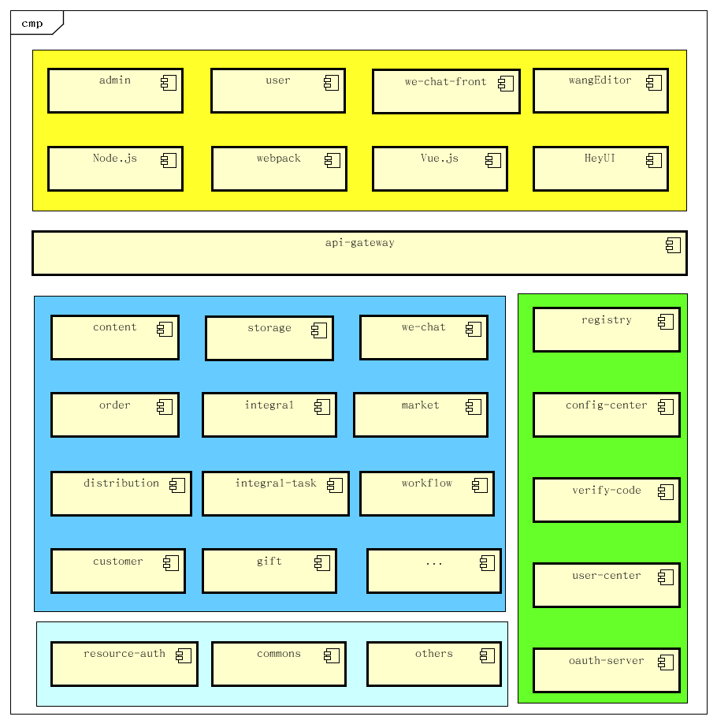

# super-portal

## 介绍
基于Spring Cloud微服务架构，支持配置中心、注册中心、网关，通过OAuth 2.0协议进行授权，并利用JWT实现用户信息的传递。
网关采用Spring Cloud Gateway为基础，动态根据注册中心扫描实现路由注册。配置中心使用的是本地文件方式进行共享。
主要模块包括：注册中心、配置中心、网关、用户中心、鉴权中心、文件存储服务、微信接入和公众号管理、内容管理等。

## 软件架构
关系数据库使用MySQL，非关系数据库使用Redis，消息队列目前使用的也是Redis。黄色部分是前端，蓝色部分是后端服务，绿色部分是后端的基础设施，浅蓝色则是被后端服务依赖使用的公共组件包。

## 安装教程

详细的安装说明参考《./portal/docs/测试环境安装手册.md》文件，根据自身情况适当调整即可。

1. 安装Node.js环境

   安装Node.js以后，主要是需要安装vue-cli: npm install @vue/cli @vue/cli-init，其他则照旧即可。如果是克隆整个项目，vue-cli也可以不安装，因为项目已经创建好了。

2. 安装Java环境

   Java环境必须要有Maven支持，并且最少要求JDK 11。配置好环境变量即可。

3. 安装数据库

   由于在配置中心里面，全部已经配置了数据库都是MySQL，所以需要安装MySQL数据库，并且最少要求8.0以上的版本。

   目前开发阶段，配置的数据库名都是cloud，可以根据实际的情况修改配置中心的参数。

4. 安装Redis

   目前开发阶段，Redis数据库的连接信息在配置中心里面设置了使用的IP是192.168.10.222，端口为6379。可以根据实际的情况修改为Redis服务集群，也应该修改为使用域名的方式访问。

## 使用说明

1. 导入测试数据

   在dev环境中，所有的服务都使用cloud数据库，并且连接的是127.0.0.1服务器。测试数据中，主要包含了用户的登录和授权信息。**<u>注意：在启动后端服务之前，先把数据导入到数据库中！</u>**

   请把cloud-2.sql导入到名为cloud的数据库中！

2. 启动后端服务

   在开发的时候，需要使用dev的profile启动程序，因为在配置中心里面，有些需要绝对路径的地方把127.0.0.1写在了dev环境中，正式环境则需要修改默认profile里面的fk.host-prefix的值，根据实际的情况来调整。此值的作用是在OAuth 2.0授权的时候用于跳转的，目前设计是全部必须通过前端来进行跳转，保证URL统一，方便处理防火墙和网络，并避免跨域访问的问题。

   后端服务的启动顺序参考portal.sh文件，此文件是Linux下的服务启动顺序，关闭时则反序。如果有bash环境可以使用./portal.sh start启动所有服务，也可以使用./portal.sh stop停止所有服务。

3. 启动前端服务

   前端服务本身不需要启动都可以的，因为在正式运行时把打包生成的文件放入Nginx里面即可。开发使用则使用npm run dev的方式启动即可。

4. 使用测试

   测试时，直接在浏览器输入 http://127.0.0.1:8080 来运行。要注意：由于dev的profile写在IP就是127.0.0.1，所以不能使用localhost来运行程序的，否则会出现跨域的问题。

   测试的登录名是13800138000，密码是1234

## 参与贡献

1. Fork 本仓库
2. 新建 Feat_xxx 分支
3. 提交代码
4. 新建 Pull Request
